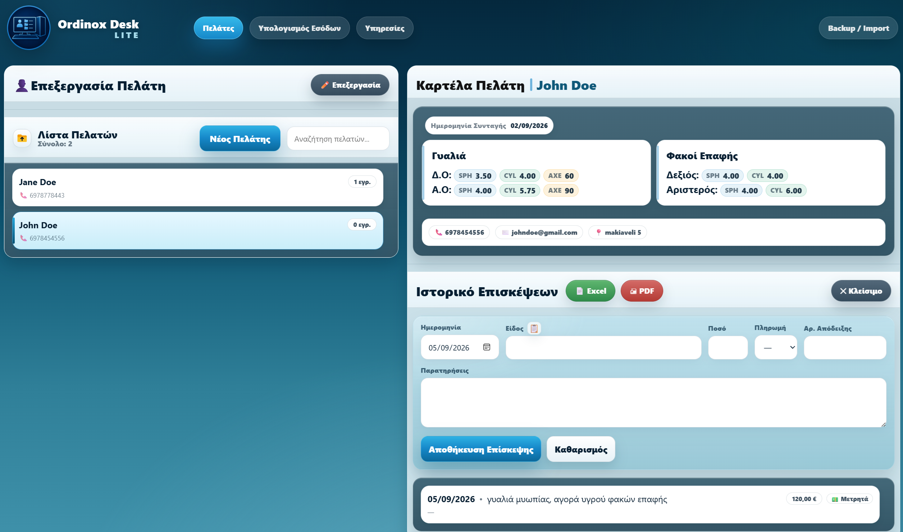
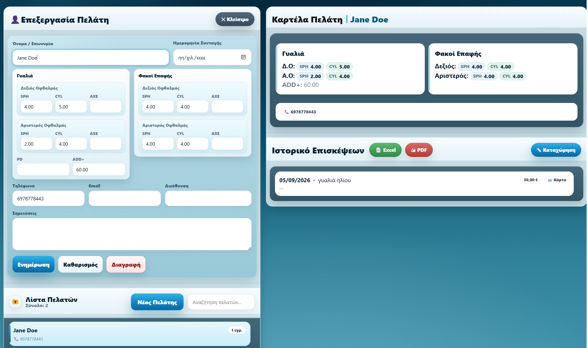
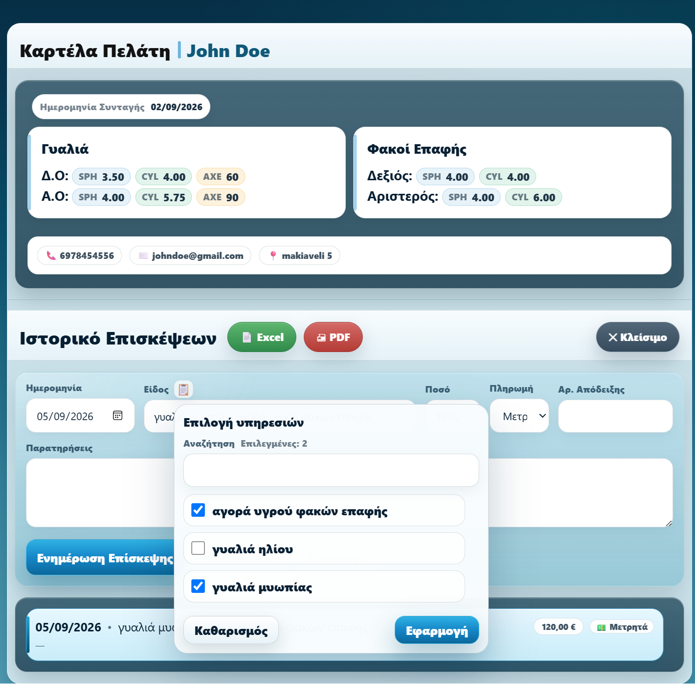
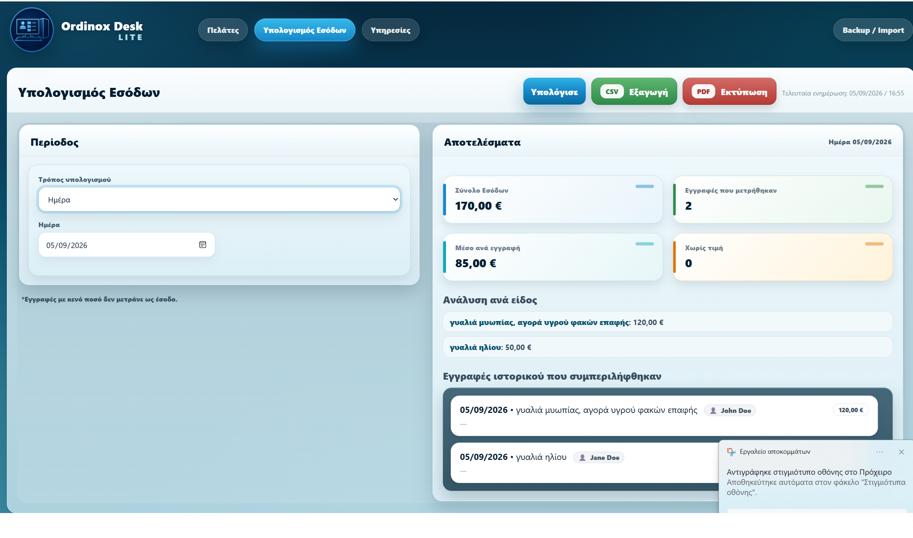
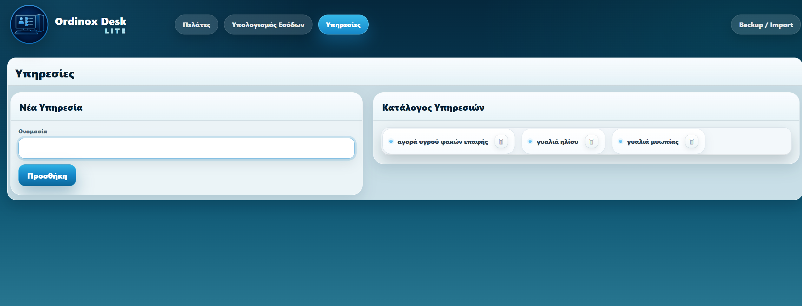
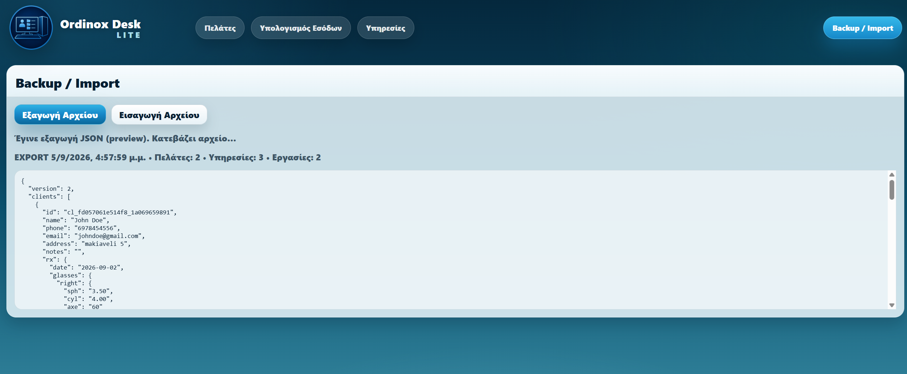

# Ordinox Desk Lite

**Local-first optical client and business management desktop application for Windows.**

Ordinox Desk Lite is a desktop application designed for optical stores and small optical businesses that need a practical way to manage clients, prescriptions, visit history, services, revenue and local business data from a single interface.

The project was developed as a focused desktop business tool with an emphasis on simplicity, fast access to client information and reliable local operation without requiring a remote backend.

---

## Tech Stack

- **Tauri 2** — desktop application framework and Windows packaging
- **Rust** — native Tauri application layer
- **Vanilla JavaScript** — application logic and state management
- **HTML5** — application structure
- **CSS3** — custom user interface
- **WebView localStorage** — local data persistence
- **JSON** — backup and data import/export
- **CSV / spreadsheet-compatible exports**
- **Windows desktop packaging** — standalone application and installer generation

Ordinox Desk Lite is designed as a **local-first application**.

Its main business logic is implemented in JavaScript, while Tauri provides the native Windows desktop environment and application packaging layer.

The application does not require a remote backend or external database server for normal operation.

---

## Application Preview

### Client Management

The application includes a structured client management workflow with:

- New client creation
- Client editing
- Client search
- Organized client list
- Quick access to client records
- Client-related information
- Visit and service history

---

### Optical Prescription Management

Each client can have optical prescription information stored directly in their record.

The application supports structured optical data such as:

- SPH
- CYL
- AXE
- PD
- ADD
- Prescription dates
- Glasses-related information
- Contact lens-related information

The goal is to keep important optical information together with the client's general record and visit history.

---

### Visit History

Client activity can be organized through a dedicated visit history.

This allows the user to review previous appointments, services and notes without relying on external spreadsheets or separate documents.

The history is designed to give quick access to previous client interactions and relevant business information.

---

### Revenue Management

Ordinox Desk Lite includes tools for tracking and reviewing revenue-related information.

The application can organize financial information associated with services and client activity and provides export functionality for further use or reporting.

---

### Services

The application includes service management functionality so commonly used services can be organized and reused throughout the client workflow.

This helps reduce repetitive data entry and keeps service information consistent.

---

### Backup & Import

Data portability and recovery are built into the application.

Available functionality includes:

- Local data backup
- JSON export
- Data import
- Backup restoration
- Imported data validation
- Recovery of stored application information

This allows users to keep copies of their data independently from the application installation.

---

## Optical Business Workflow

Ordinox Desk Lite was designed around a practical optical-store workflow.

A typical workflow can include:

1. Creating or locating a client
2. Reviewing existing client information
3. Recording optical prescription data
4. Adding a new visit or service
5. Reviewing previous client history
6. Tracking related revenue
7. Exporting or backing up stored information

The purpose of the application is to bring these tasks together into one focused desktop environment.

---

## Local-First Architecture

Ordinox Desk Lite operates locally on the user's Windows computer.

For normal use:

- No remote backend is required
- No cloud database is required
- Application data is stored locally
- Backup files can be created by the user
- Existing data can be restored through the import workflow
- The application can be used without depending on a continuous internet connection

This makes the application suitable for standalone desktop use.

---

## Windows Desktop Application

Ordinox Desk Lite runs as a standalone Windows application using **Tauri 2**.

The project includes configuration for:

- Native Windows execution
- Application identity and branding
- Application icons
- Release builds
- Windows packaging
- Installer generation

The interface and main business logic are implemented with HTML, CSS and Vanilla JavaScript, while Tauri provides the desktop runtime and packaging environment.

This allows the application to be installed and used like a normal Windows program rather than running only inside a browser.

---

## Data Export

The application includes functionality for exporting business information in practical formats.

Depending on the workflow, exported information can include:

- Client-related data
- Revenue information
- Spreadsheet-compatible files
- Printable / PDF-ready output
- JSON backup files

These features were added to make stored information easier to transfer, archive or use outside the application.

---

## Development Approach

Ordinox Desk Lite was developed incrementally.

The development workflow includes:

1. Understanding the required business workflow
2. Designing the appropriate feature
3. Implementing the change
4. Reviewing affected code
5. Running and testing the application
6. Checking existing functionality for regressions
7. Refining the interface where necessary
8. Avoiding unrelated changes

This approach helps keep the application stable while new functionality is added.

---

## AI-Assisted Development

AI-assisted development tools are an important part of my development workflow, particularly **OpenAI Codex**.

AI tools are used for tasks such as:

- Existing code analysis
- Feature implementation
- Debugging
- Investigating bugs
- Code refinement
- Reviewing possible side effects of changes
- Exploring alternative implementations
- Assisting with testing and validation

AI-generated changes are not applied blindly.

Changes are reviewed and tested incrementally, with particular attention to maintaining existing functionality and avoiding unrelated modifications.

My workflow combines AI-assisted implementation with human review, testing, debugging and product decisions.

---

## What I Learned From This Project

Developing Ordinox Desk Lite has given me practical experience in:

- Desktop application development
- Designing a specialized business workflow
- Client data management
- Optical prescription data structures
- Application state management
- Local data persistence
- HTML, CSS and Vanilla JavaScript
- UI/UX refinement
- Search and filtering workflows
- Debugging and troubleshooting
- Data validation
- Backup and restore functionality
- Data export workflows
- Tauri application configuration
- Windows application packaging
- Installer preparation
- AI-assisted software development
- Iterative product development

---

## Project Structure

The application uses a web-based frontend inside a Tauri desktop environment.

The project is organized around:

- HTML for application structure
- CSS for the custom interface
- JavaScript for application logic and state
- Tauri configuration for the desktop environment
- Rust/Tauri bootstrap code for the native application shell
- Local storage for application data
- JSON-based backup and import workflows

The majority of the application's business logic is implemented in JavaScript.

---

## Test Data & Privacy

All names, phone numbers, optical prescriptions, visits and other personal information visible in the screenshots in this repository are **fictional test data**.

They do not represent real clients or individuals.

No real client data is included in this portfolio repository.

---

## Source Code

The full production source code of Ordinox Desk Lite is currently maintained privately.

This repository is intended as a **project showcase and portfolio presentation**, containing documentation and visual material demonstrating the application's functionality and development process.

The complete source code is not included in this showcase repository.

Additional technical material or source access may be provided when appropriate.

---

## Project Status

**Functional personal software project.**

Ordinox Desk Lite is a working Windows desktop application focused on optical client and business management.
